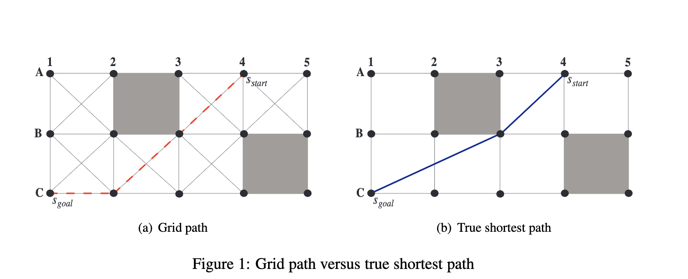
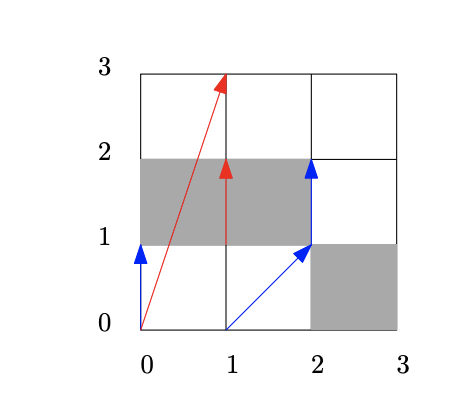
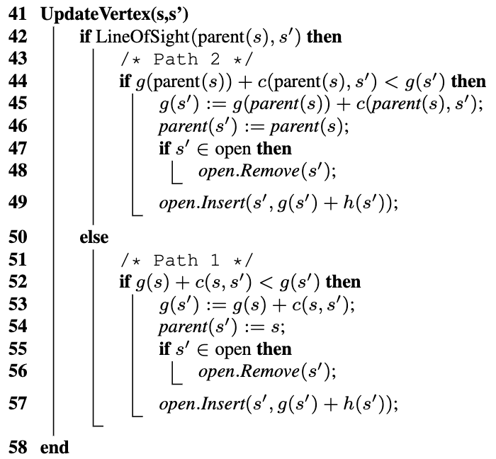

# HS
**Theta\*: Any-Angle Path Planning on Grids**

Задача: планирование пути на графах регулярной декомпозиции с восемью соседями с заблокированными и незаблокированными ячейками одинакового размера. В качестве вершин используются углы ячеек (а не их центры). Задача планирования пути состоит в том, чтобы найти незаблокированный путь от заданных начальных вершин до заданной целевой вершины.

Статья: https://www.jair.org/index.php/jair/article/view/10676/25515

**Описание алгоритма**

Путь считается незаблокированным тогда и только тогда, когда каждая вершина этого пути является line-of-sight для следующей вершины пути.

g - длина кратчайшего пути от начальной вершины до вершин, найденных на данный момент, и, следовательно, оценка начального расстояния до вершин.
h - расстояния от текущей вершины до цели. A* использует значение h для вычисления значения f. Значение f(s) = g(s) + h(s) - это оценка длины кратчайшего пути от начальной вершины через текущую до целевой вершины.
parent(s) используется для извлечения пути от начальной вершины к целевой вершине после завершения A*.

Обновление вершины происходит согласно следующему алгоритму:

Theta * не является оптимальным (то есть не гарантируется нахождение истинных кратчайших путей), потому что родитель вершины должен быть либо видимым соседом вершины, либо родителем видимого соседа, что не всегда верно для истинного кратчайшие пути.

Данная программа принимает на вход карту (в формате строки или файл где символ '#' означает заблокированную ячейку, а '.' свободную), стартовые координаты и координаты цели. На выходе получаем путь от стартовой вершины к целевой.
